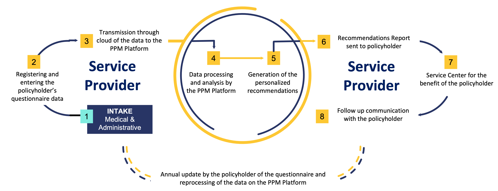
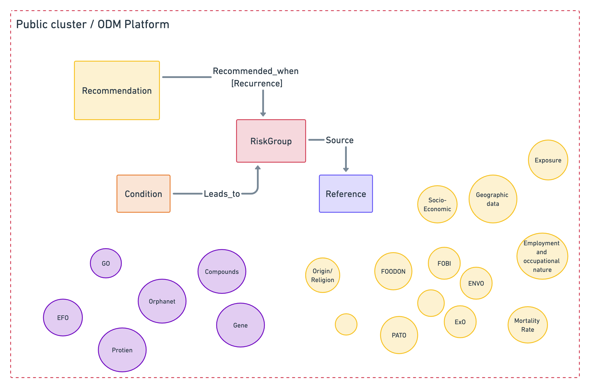

PPM
===

.. important:: An explanation must be added

:kbd:`Content`

A product to provide health insurance policyholders with individualized recommendations for diagnostic testing, promoting preventive and personalized health.

Index of the medical recommendations for the graph.

1. The recommendations are taken from multiple sources, the largest data was taken from the MOH recommendation document 

2. For each recommendation we also have a reference and link to the reference article that our recommendation is based on. 

3. Each recommendation is fit to specific groups in the population according to a lot of properties such as: age (min/max), gender,family history of illness, and other environmental variables, place of residence, odm_id etc.

.. toctree::
   recommendations
   conditions
   cities
