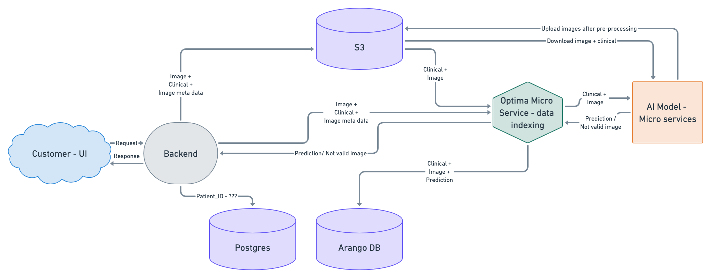
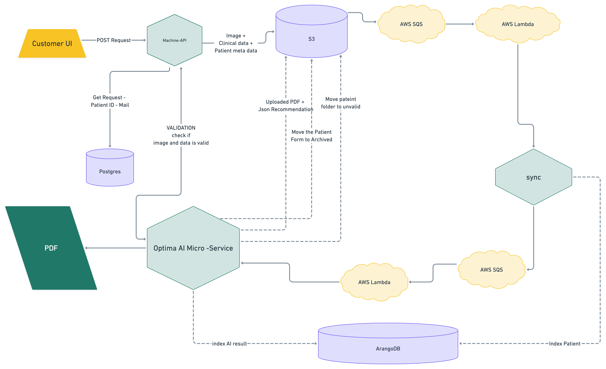

OPTIMA STROKE
=============
OPTIMA is a service that uses panoramic dental x-rays to detect calcification in the Common Carotid Artery for early diagnosis of stroke risk.

Architecture
~~~~~~~~~~~~

APIs
~~~~

Upload Optima Patient API
+++++++++++++++++

:kbd:`POST /api/v1/image_recognition/upload_optima_patient`

   upload new patient details files to s3 bucket, clinical data and metadata

   **Parameters**:

   :patient_clinical: json (required), the patient clinical data

   :patient_metadata: json (required), the patient metadata

   **Responses**:

   :statuscode 200: files uploaded successfully
   :statuscode 500: The function get some error.
   :statuscode 404: There's an error in the input parameters.

   **Example request**:

   .. sourcecode:: python

      import requests
      import json

      URL = 'https://<NETWORK>/api/v1/image_recognition/upload_optima_patient'
      clinical_data = json.load(open('patient_data.json', 'rb'))
      metadata = json.load(open('patient_metadata.json', 'rb'))
      response = requests.post(
            URL,
            json={
            'patient_clinical': clinical_data,
            'patient_metadata' : metadata'

      )
      print(response.json())

   The content of ``patient_data.json`` is like:

   .. sourcecode:: json

      { 
         "Patient_Odm_ID":"odm1",
            "Gender": "M",
            "Age":27,
            "Height":186,
            "Weight":77,
            "BMI":22,
            "Is_Smoker":0,
            "Has_Diabetes":0,
            "Heart_Problems":0,
            "High_Cholesterol":0,
            "Stroke":0,
            "Hyperlipidemia":0,
            "Cases_Of_Stroke_In_Family":1,
            "Cases_Of_Heart_Problems_In_Family":0,
            "Prescription_Drugs":["Asperin","Akamol"]
         }

   The content of ``patient_metadata.json`` is like:

   .. sourcecode:: json
      { 
      "Patient_Odm_ID":"odm1",
      "Clinic":"mg-smile",
      "Fill_Date":"2022-09-28-16-22-26"
      }

