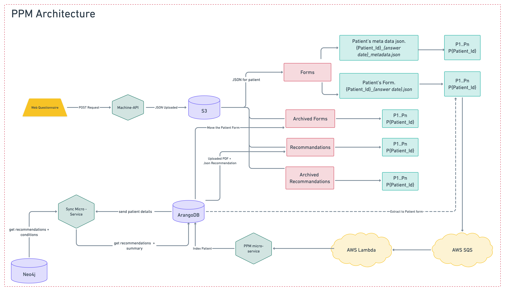

PPM
===
A product to provide health insurance policy holders with individualized recommendations for diagnostic testing, promoting preventive and personalized health.

.. image:: ppm_flow.png

Architecture
~~~~~~~~~~~~

Prerequisites
~~~~~~~~~~~~~

1. Medical recommendations data should be indexed onto the neo4j graph.

   .. image:: ppm_graph.png

   * Data for the recommendations was taken from several sources, the majority came from the MOH 2022 recommendation document.

   * In addition to the recommendations, there are links to articles and links that provide further information.

   * Every recommendation is tailored to specific groups of the population based on a number of factors, such as their age (minimum/maximum), gender, biochemical variables, and other factors.

2. Both the questionnaire file and the metadata file should be in the correct place in S3.

   For example for patient number 10000 that uploaded to S3 in 9/7/22 6:46:12 the S3 hierarchy is:

      Questionnaire file: ``PPM/Forms/Patient_Data/P10000/10000_2022-09-07-06-46-12.json``

      Metadata file: ``PPM/Forms/Metadata//P10000/10000_2022-09-07-06-46-12.json``

Important files
~~~~~~~~~~~~~~~

.. toctree::
   :maxdepth: 1

   important_files

APIs - FEMI ACCESS
~~~~~~~~~~~~~~~~~~

.. important:: Authorization Required

   Passwords and usernames are required to access these APIs.

Upload patient API
+++++++++++++++++

:kbd:`POST /api/v1/ppm/upload_ppm_patient_to_s3`

   Upload the patient's questionnaire file to the S3 bucket.

   **Parameters**:

   :patient_json: json (required), A json object of the patient's questionnaire.

   **Responses**:

   :statuscode 200: file uploaded successfully.
   :statuscode 500: The function get some error.
   :statuscode 404: There's an error in the input parameters.

   **Example request**:

   .. sourcecode:: python

      import requests
      from requests.auth import HTTPBasicAuth
      import json

      URL = 'http://dev-eu-central-1-femi-ppm.dev.internal.od-machine.com/api/v1/ppm/upload_ppm_patient_to_s3'
      data = json.load(open('body.json', 'rb'))
      response = requests.post(
            URL,
            json=data,
            auth=HTTPBasicAuth(<'usr'>, <'pass'>)
      )
      print(response.json())

   The content of ``body.json`` is like:

   .. sourcecode:: json

      {
         'patient_json': {'Fill_Date': '2023-02-01-13-37-39', 'Integration_Client': 'Femi', 'Client': 'Ayalon', 'Address_City': 967, 'Address_Street': 555, 'Main_Address_Last_5_Years_City': 33, 'Main_Address_Last_5_Years_Street': 556, 'At_Risk_Of_Contracting_Hiv': 0, 'Atherosclerosis_At_Young_Age_Relatives': 0, 'Average_Alcohol_Consumption': '3 glasses or more of alcoholic beverage per day', 'Average_Cigarettes_A_Day_Is_Smoker': '', 'Average_Cigarettes_A_Day_Past_Smoker': '', 'B6_B12_Supplements': 0, 'Blood_Pressure_Measured_In_The_Last_3_Years': '', 'Blood_Pressure_Measured_In_The_Last_5_Years': '', 'Blood_Pressure_Measured_In_The_Last_Year': 0, 'Blood_Transfusion_Before_1992': 0, 'Cases_Of_Diabetes_In_Family': 0, 'Colon_Cancer_Now_Or_Past': 0, 'Colon_Or_Rectal_Cancer_In_Family': 0, 'Colon_Or_Rectal_Cancer_In_Family_Youngest_Age': '', 'Consume_A_Lot_Of_Red_Meat': 0, 'Consume_Processed_Meats_Often': 0, 'Country_Of_Birth': 'Afghanistan', 'Date_Of_Birth': '01.01.1965', 'Diagnosed_With_Osteoporosis': 0, 'Do_Sport': 0, 'Done_A_Blood_Glucose_Test_In_Last_3_Years': '', 'Done_A_Colonoscopy_In_Last_5_Years': '', 'Done_A_Fecal_Occult_Blood_Test_Last_Year': 0, 'Done_A_Lipid_Profile_Test_Before': '', 'Done_A_Lipid_Profile_Test_In_The_Last_2_Years': 0, 'Done_A_Lipid_Profile_Test_In_The_Last_5_Years': '', 'Done_A_Vision_Test_After_40': 0, 'Done_Colonoscopy_After_Presence_Of_Blood_In_Stool': '', 'Done_Colonoscopy_In_Last_10_Years': 0, 'Done_Us_On_Aorta': '', 'Education': 'high school', 'Exposed_To_Diesel_Emissions_For_Over_15_Years': 0, 'Exposed_To_Prolonged_Passive_Smoking': 0, 'Exposed_To_Sun_At_Least_Two_Hours_A_Day': 0, 'Exposure_To_Asbestos_In_The_Past': 0, 'F': 0, 'Family_History_Fap': 0, 'Family_History_Lynch_Syndrom_Or_Hnpcc': 0, 'Family_History_Of_Prostate_Cancer_Before_70_First_Degree_Relative': 0, 'Felt_Depressed_Or_Despaired_Or_Hopeless_In_Past_Month': 0, 'Felt_Lake_Of_Interest_Or_Lack_Of_Pleasure_In_Past_Month': 0, 'Had_An_Ecg': 0, 'Has_Diabetes': 0, 'Has_Hypertension': 0, 'Heart_Disease_At_Young_Age_Relatives': 0, 'Height': 192, 'Hmo': 'clalit', 'Hyperlipidemia_Relatives': 0, 'Immune_To_Hepatitis_B': 1, 'Inflammatory_Bowel_Disease': 0, 'Is_Smoker': 0, 'Is_Smoking_Other_Stuff': 0, 'Know_Disease_That_Increases_Chance_Of_Osteoporotic_Fracture': 0, 'Light_Eyes': 0, 'Light_Hair': 0, 'Light_Skin': 0, 'Lipoprotein_Test_In_The_Past': 0, 'Lung_Cancer_Now_Or_Past': 0, 'M': 1, 'Marital_Status': 'married', 'Melanoma_Cancer_Now_Or_Past': 0, 'Melanoma_Relatives': 0, 'Multiple_Moles_On_Body': 0, 'Number_Of_Children': 1, 'Origin': ['Christian Arab'], 'Past_Smoker': 0, 'Patient_Id': 12345, 'Presence_Of_Occult_Blood_In_The_Stool': '', 'Prolonged_Exposure_To_Ionizing_Radiation': 0, 'Prolonged_Exposure_To_Petroleum': 0, 'Prolonged_Exposure_To_Polychlorinated_Bipehnyls': 0, 'Prolonged_Exposure_To_Selenium': 0, 'Prostate_Cancer_Now_Or_Past': 0, 'Reccurent_Falls': '', 'Received_Booster_For_Tetanus_In_Last_10_Years': 1, 'Skin_That_Burns_In_The_Sun_Easily': 0, 'Steroid_Treatement_For_3_Month_Or_More': 0, 'Suffer_From_Sleep_Disturbances': 0, 'Treated_With_Puva': 0, 'Treated_With_Radiation_In_Abdominal_Area': 0, 'Unusual_Moles': 0, 'Urinary_Disorders': '', 'Used_Drugs_By_Injection': 0, 'Using_4_Medications_Or_More': '', 'Vaccinated_Against_Herpes_Zoster': 1, 'Vaccinated_Against_Hpv': '', 'Vaccinated_Against_Pneumococcal_Pneumonia_After_Age_65': '', 'Vaccinated_Against_Pneumococcal_Pneumonia_Between_Age_60_To_65': '', 'Vaccinated_For_Seasonal_Flu_This_Year': 1, 'Vaccinated_With_All_Routine_Israeli_Vaccines': 1, 'Weight': 160, 'Year_Of_Vaccination_Against_Pneumococcal_Pneumonia': '', 'Year_Of_Vision_Test': '', 'Years_Of_Smoking_Is_Smoker': '', 'Years_Of_Smoking_Past_Smoker': '', 'Years_Without_Smoking': '', 'Language': 'he'}
      }

   Check out the :ref:`ppm-microservice` section for further information about the API implementation.

Get recommendations pdf API
+++++++++++++++++++++++++++

:kbd:`GET /api/v1/ppm/get_ppm_recommendations_file`

   Return the patient's recommendations pdf file from the S3 bucket.

   **Parameters**:

   :patient_id: string (required), The patient's UUID.

   **Responses**:

   :statuscode 200: file returned successfully.
   :statuscode 500: The function get some error.
   :statuscode 404: There's an error in the input parameters.

   **Example request**:

   .. sourcecode:: python

      import requests
      from requests.auth import HTTPBasicAuth

      URL = 'http://dev-eu-central-1-femi-ppm.dev.internal.od-machine.com/api/v1/ppm/get_ppm_recommendations_file'
      response = requests.post(
            URL,
            data={'patient_id': '12345'},
            auth=HTTPBasicAuth(<'usr'>, <'pass'>)
      )
      print(response.content)
   
   **Example response**:

   .. sourcecode:: python

      HTTP/1.1 200 OK
      Content-Type: application/pdf
      Content-Disposition: inline; File_Name="sample.pdf"

      [Binary content of the PDF file]

   Check out the :ref:`ppm-microservice` section for further information about the API implementation.

