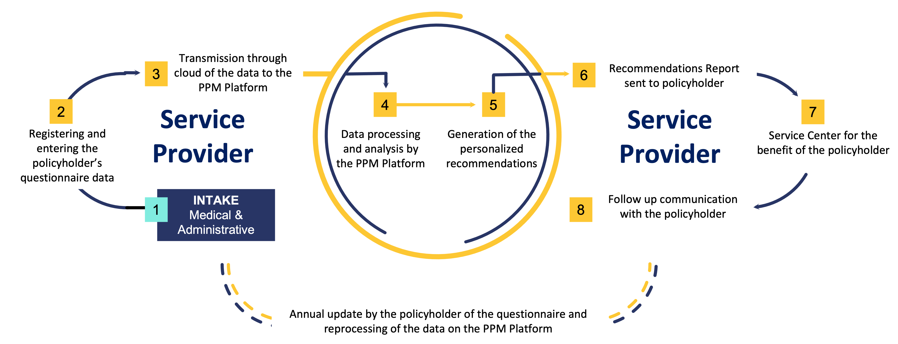
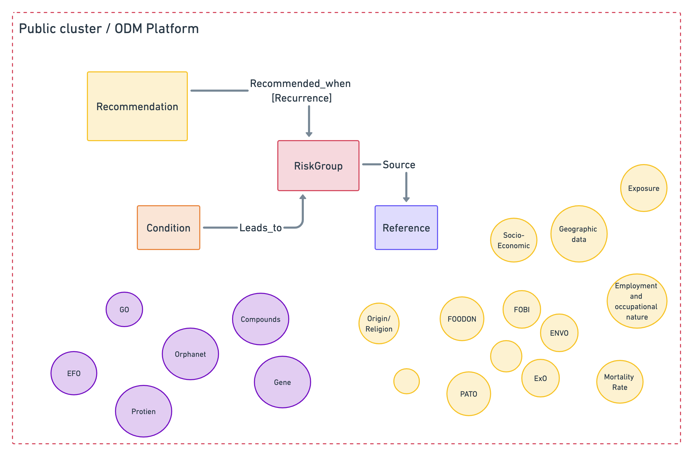

PPM
===
A product to provide health insurance policyholders with individualized recommendations for diagnostic testing, promoting preventive and personalized health.

Prerequisites
~~~~~~~~~~~~~

Medical recommendations data should be indexed onto the neo4j graph.

Data for the recommendations was taken from several sources, but the majority came from the MOH 2022 recommendation document, along with references and links to the reference articles for further information.

Every recommendation is tailored to specific groups of the population based on a number of factors, such as their age (minimum/maximum), gender, biochemical variables, and other factors.

APIs
~~~~

index patient API
+++++++++++++++++

:kbd:`POST /api/v1/ppm/index_ppm_patient`

   Index the patient's questionaire details from S3 bucket to the ArangoDB.

   **Parameters**:

   :path_patient_details: string (required), Path to the patient details in S3 bucket.

   :client: string (required), The client name.

   :host_client: string (required), The host client name.

   **Responses**:

   :statuscode 200: The patient index's has been successful.
   
   :statuscode 500: The function get some error.

   :statuscode 404: There's an error in the input parameters.

   **Example request**:

   .. sourcecode:: python

      import requests
      import json
      URL = 'https://<NETWORK>/api/v1/ppm/index_ppm_patient'
      data = json.load(open('body.json', 'rb'))
      response = requests.post(
            URL,
            json=data
      )
      print(response.json())

   The content of ``body.json`` is like,

   .. sourcecode:: json

      {
         "path_patient_details": "PPM/Forms/Patient_Data/P10000/10000_2022-09-07-06-46-12.json",
         "host_client": "host_client_name", 
         "client": "client_name"
      }

   Check out the :ref:`reference-name` section for further information about the API implementation.

Sync-Microservice
~~~~~~~~~~~~~~~~~

The purpose of this microservice is to match each patient with the recommendations intended for him, to upload recommendations to S3 and to create connections between the patients and their recommendations in ArangoDB.

update recommendations API
++++++++++++++++++++++++++

:kbd:`POST /api/v1/ppm/update_patients_conditions_and_recommendations`

   Index the patient's questionaire details to the ArangoDB.

   **Example request**:

   .. sourcecode:: python

      import requests
      import json
      URL = 'https://<NETWORK>/api/v1/ppm/update_patients_conditions_and_recommendations'
      data = json.load(open('body.json', 'rb'))
      response = requests.post(
            URL,
            json=data
      )
      print(response.json())

   The content of ``body.json`` is like,

   .. sourcecode:: json

      {
         "host_client": "femi", 
         "client": "ayalon"
      }

   **Example response**:

   :statuscode 200: Successfully updated the patients
